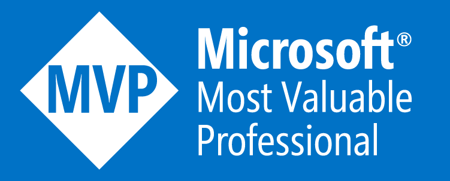
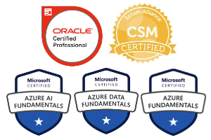

<!-- _class: lead -->

# Azure quase de graça
## Como publicar sem gastar uma fortuna

---

# Rodrigo Tavares

Head de Soluções e Transformação na Develcode
MVP Microsoft · 25 anos de carreira

**Algumas habilidades**

- Java, Angular, React, Node.js, .NET, Go, Python
- IA, SRE, Cloud, DevOps
- Linux SysAdmin, Kubernetes
- Data Science
- Computer Telephony Integration
- Arquitetura TI E2E

###### linktr.ee/expertostech

---

# Antes de começar, um breve dicionário

- **FinOps:** prática de gestão e otimização de custo na nuvem
- **SLA:** Service Level Agreement, garantia contratual de disponibilidade
- **Cold start:** atraso na primeira execução depois que o recurso fica parado
- **DLQ:** Dead-Letter Queue, fila que recebe mensagens que falharam
- **Poison queue:** o nome que o Functions dá à DLQ de uma fila Storage Queue
- **RU/s:** Request Unit por segundo, a unidade de capacidade do Cosmos DB
- **vCPU-segundo / GiB-segundo:** unidades de cobrança por tempo de processamento e memória usados
- **CDN:** Content Delivery Network, entrega conteúdo a partir de cache perto do usuário
- **NoSQL:** banco de dados sem tabelas relacionais fixas
- **LRS / GRS:** redundância local ou geográfica dos dados no Storage
- **PoP:** Point of Presence, ponto da rede de borda onde o usuário se conecta

---

# Esqueci que existe um negócio chamado CUSTO

- **Você trabalha em empresas grandes**
  - Orçamento de infraestrutura que parece infinito
  - Ninguém questiona o custo de mais um ambiente
- **Seu projeto pessoal chegou**
  - Hora de criar aquela arquitetura que o arquiteto nunca deixou
  - Kubernetes, observabilidade, logs centralizados, microsserviços, serviços assíncronos
  - Múltiplas instâncias de banco, ambientes dev, qa e prod

---

# De cor, sem escrever uma linha

- **Você cria o resource group e começa**
  - Não precisa nem desenhar: essa arquitetura mora na sua cabeça há anos
- **Só que agora é diferente**
  - Não tem arquiteto para dizer "isso não cabe"
  - Não tem FinOps perguntando o custo do ambiente
  - É só você, o cartão de crédito e uma arquitetura pensada para escala horizontal e vertical

---

# Minha infra dos sonhos — borda e computação

| Componente | Serviço do Azure |
|---|---|
| Porta de entrada global | Azure Front Door Premium *(vemos às 16h)* |
| Gateway de API | Azure API Management Premium, multi-região |
| Os dois microsserviços | Azure Kubernetes Service (AKS), multi-node pool |
| Comunicação entre serviços | Istio-based service mesh add-on |
| Imagens dos containers | Azure Container Registry Premium, geo-replicado |

---

# Minha infra dos sonhos — dados e mensageria

| Componente | Serviço do Azure |
|---|---|
| Banco do microsserviço de pedidos | Azure DocumentDB (compatível com MongoDB) |
| Banco do microsserviço de pagamentos | Azure Database for PostgreSQL, Flexible Server |
| Stream de eventos entre os serviços | Event Hubs com protocolo Kafka |
| Fila de reprocessamento (dead-letter) | Azure Service Bus *(Kafka não tem DLQ nativo)* |

---

# Minha infra dos sonhos — observabilidade, segurança e ambientes

| Componente | Serviço do Azure |
|---|---|
| Métricas, logs e traces da aplicação | Azure Monitor + Application Insights |
| Métricas do cluster Kubernetes | Azure Monitor managed service for Prometheus |
| Dashboards | Azure Managed Grafana |
| Segredos e certificados | Azure Key Vault |
| Isolamento de rede | Virtual Network + Private Endpoint |
| Ambientes separados | dev, qa e prod, cada um com seu resource group |

---

# Como tudo isso conversa

---

# E quando chega a fatura

≈ R$ 23.250 / mês

por ambiente

- Empresa grande tem desconto por volume e faturamento gigante: esse valor é troco
- Só o gateway de API sozinho já custa mais que o resto da arquitetura junto
- Pra um projeto pessoal — sem cliente, sem usuário, só você e um sonho — isso é dinheiro parado todo mês
- × 3 ambientes idênticos ≈ R$ 70 mil/mês

---

# O sonho quase perdido

- **Sempre teremos limitadores** — de dinheiro, tempo ou conhecimento
- **Isso não é um "nunca"**, é um "ainda não": a arquitetura dos sonhos é cara demais **pra começar**
- **Seu cliente final não liga pra sua arquitetura**
  - Ele quer uma aplicação estável, sem erro
  - Visualmente agradável e que entregue valor

---

# Você quer produto e valor, ou só tecnologia?

- **No fim das contas, sua aplicação real só precisa de três coisas**
  - Escalar fácil, se um dia crescer
  - Backup
  - Logs básicos pra manutenção
- **A boa notícia:** dá pra ter tudo isso sem gastar uma fortuna

---

<!-- _class: lead -->

# Vou te apresentar o Azure super econômico

---

# Finalmente uma boa notícia

- **Você deve estar pensando:** "então vou ter que fazer um monolito, uma arquitetura antiga, pra economizar"
- **A resposta é não**
  - Dá pra ter tudo que tínhamos na arquitetura dos sonhos
  - Só que escolhendo as peças certas

---

# Vamos pensar em capacidades e não tecnologia

- **Computação** — onde seu código roda *(era AKS + Istio)*
- **Banco de dados** — guardar e consultar dados *(eram MongoDB e PostgreSQL)*
- **Mensageria** — comunicação entre serviços, sem travar tudo junto *(era Kafka + Service Bus)*
- **Porta de entrada** — receber e distribuir o tráfego *(eram Front Door + API Management)*
- **Observabilidade** — saber o que está acontecendo *(eram Prometheus, Grafana e Monitor)*
- **Segredos** — guardar senhas e chaves com segurança *(era Key Vault)*

---

<!-- _class: lead -->

# O Azure disponibiliza mais de 65 serviços sempre gratuitos, você sabia?

---

# O que é sempre grátis — computação

| Serviço | O que faz | Limite do gratuito |
|---|---|---|
| Static Web Apps (Free) | Hospeda site estático/SPA + API gerenciada via Functions | 250 MB por app, 2 domínios próprios, sem SLA |
| App Service (F1) | Hospeda apps web e APIs | 60 min de CPU/dia, 1 GB RAM, sem domínio próprio |
| Functions (Consumption, legado) | Roda código sob demanda | 1 milhão de execuções + 400.000 GB-s por mês |
| Functions (Flex Consumption, recomendado) | Mesmo modelo, escala mais rápido | 250 mil execuções + 100.000 GB-s por mês |
| Container Apps (Consumption) | Roda containers sob demanda | 180.000 vCPU-s + 360.000 GiB-s + 2 milhões de requisições/mês |

---

# O que é sempre grátis — dados e mensageria

| Serviço | O que faz | Limite do gratuito |
|---|---|---|
| Cosmos DB (free tier) | Banco NoSQL gerenciado | 1.000 RU/s + 25 GB de armazenamento, pra sempre |
| Azure SQL Database (free offer) | Banco relacional gerenciado | 100.000 vCore-segundos + 32 GB/mês, até 10 bancos |
| Event Grid | Roteamento de eventos (pub/sub) | 100.000 operações/mês |

---

# O que é sempre grátis — porta de entrada e observabilidade

| Serviço | O que faz | Limite do gratuito |
|---|---|---|
| Static Web Apps (CDN embutido) | Distribuição global de conteúdo | Incluso no free tier, sem custo à parte |
| Azure Monitor (Log Analytics) | Logs, métricas e alertas | 5 GB de ingestão por mês |

---

# Não é free mas é muito barato

| Serviço | O que faz | Custo aproximado |
|---|---|---|
| Storage Account (Blob, Hot LRS) | Aguarde, veremos a seguir | ~US$ 0,018/GB por mês |
| Functions (além da franquia grátis) | Execuções extras de código sob demanda | US$ 0,20/milhão (Consumption) · US$ 0,40/milhão (Flex) |
| Key Vault | Guarda segredos e certificados | ~US$ 0,03 a cada 10 mil operações, sem taxa fixa |
| Azure DNS | Hospeda seu domínio | ~US$ 0,50/zona/mês + US$ 0,40/milhão de consultas |
| Container Instances (ACI) | Roda um container avulso, sem orquestração | ~US$ 0,0000125/vCPU-segundo |
| Logic Apps (Consumption) | Automatiza fluxos (notificação, integração) | 4.000 ações grátis, depois US$ 0,000025/ação |
| Azure Backup | Backup automático e restaurável | ~US$ 5/mês (instância até 50 GB) + armazenamento |
| Front Door (Standard) | Só compensa se a aplicação for global | US$ 35/mês + uso — vale a pena *(vemos às 16h)* |

---

# Te apresento: O Canivete Suíço

- **Blob** — arquivos, imagens, backups, qualquer objeto
- **Queue** — fila de mensagens entre partes da aplicação
- **Table** — banco chave-valor NoSQL, sem schema
- **Site estático** — hospeda HTML/CSS/JS direto do Blob, sem custo extra além do storage

---

# Nossa arquitetura

| Capacidade | Serviço |
|---|---|
| Computação | Azure Functions (Orders e Payments) |
| Banco de dados — pedidos | Table Storage |
| Banco de dados — pagamentos | Cosmos DB free tier (400 RU/s) |
| Mensageria + DLQ | Storage Queue + fila poison automática |
| Observabilidade | Application Insights (só nível Error) |
| Segredos | Key Vault |
| Backup | Cosmos: grátis por padrão · Table: sem proteção extra |
| Porta de entrada | Nenhuma — URL própria de cada Function |

---

# Como tudo isso conversa

---

# Quanto realmente custa

| Item | Uso em 30 dias | Custo |
|---|---|---|
| Functions (2 microsserviços) | ~200 mil execuções | Grátis (dentro da franquia) |
| Cosmos DB (400 RU/s) | < 25 GB | Grátis (free tier) |
| Table Storage | < 1 GB, poucas mil transações | ~US$ 0,02–0,05 |
| Storage Queue | Poucas mil mensagens | ~US$ 0,01 |
| Application Insights (só Error) | Poucos MB | Grátis (até 5 GB) |
| Key Vault | Poucas centenas de operações | ~US$ 0,001 |

---

# Uma fatura que dá pra pagar

≈ R$ 0 / mês

para os dois microsserviços juntos

- Functions, Cosmos DB e Application Insights ficam dentro da franquia grátis
- Table Storage e Queue custam centavos — arredonda pra zero
- Nada de ambiente triplicado: só uma versão, do jeito que o projeto pessoal precisa

---

# Mas a Microsoft diz: não use free em produção

- **Depende do serviço**
  - App Service F1 e Static Web Apps Free: sem SLA, "para projetos pessoais"
  - Cosmos DB free tier: a doc diz "small production workloads" — **com SLA**
- **Functions, Storage e Key Vault são os mesmos serviços de produção**
  - A franquia grátis é desconto, não um tier de brinquedo
- **Para quem está começando, tudo bem**
  - Aplicação nova, poucos usuários: o risco é baixo
  - A infra cresce junto com o faturamento, não antes dele

---

# E se minha aplicação for global

US$ 35 / mês

Azure Front Door (Standard)

- Faz cache do conteúdo estático nos PoPs perto do usuário — resposta mais rápida
- Do PoP até a origem, o tráfego segue pela rede privada de fibra da Microsoft, reduzindo a latência
- Saiba mais: minha palestra "Azure Front Door", sala 102, às 16h

---

# Mas isso escala?

- **Sim, sem trocar de arquitetura**
  - Cosmos DB: só aumentar o RU/s provisionado
  - Functions: escala sozinho, sob demanda, sem configurar nada
- **Não quer usar Functions?**
  - Azure Container Apps: Kubernetes por baixo, mas sem cluster pra gerenciar
  - Permite manter uma instância sempre ativa, pra evitar cold start
  - Mesmo assim, continua muito barato (poucos dólares por mês)

---

<!-- _class: lead -->

# Talk is cheap. Show me the bill.

---

<!-- _class: lead -->

# Todo o material está no GitHub

  
  

github.com/expertos-tech/mvpconf-2026

---

<!-- _class: lead -->

# Obrigado!

Hoje às 16h: **Azure Front Door** 🌎

---

<!-- _class: lead -->

# Apêndice

---

# Comece de graça no Azure

- **US$ 200 de crédito** (convertidos para a moeda da sua cobrança) para usar em 30 dias
- **Mais de 20 serviços gratuitos por 12 meses**, em quantidades mensais limitadas (só para clientes novos)
- **Mais de 65 serviços sempre gratuitos**, também dentro de limites mensais
- **Cartão de crédito ou débito:** usado para verificar sua identidade
  - Pode haver uma autorização temporária de US$ 1, estornada depois
  - Não há cobrança, a menos que você faça upgrade para pagamento conforme o uso
- **Acabou o crédito ou passaram os 30 dias?** Os serviços são desativados até você fazer o upgrade

---

# Referências

| Slide | Fonte |
|---|---|
| Minha infra dos sonhos — borda e computação | [Istio add-on](https://learn.microsoft.com/azure/aks/istio-about), [Container Registry pricing](https://c3x.dev/blog/azure-container-registry-cost/) |
| Minha infra dos sonhos — dados e mensageria | [Azure DocumentDB](https://learn.microsoft.com/azure/documentdb/overview), [PostgreSQL overview](https://learn.microsoft.com/azure/postgresql/overview), [Kafka protocol](https://learn.microsoft.com/azure/event-hubs/azure-event-hubs-apache-kafka-overview), [Service Bus DLQ](https://learn.microsoft.com/azure/service-bus-messaging/service-bus-dead-letter-queues) |
| Minha infra dos sonhos — observabilidade... | [Managed Prometheus](https://learn.microsoft.com/azure/azure-monitor/metrics/prometheus-metrics-overview), [Log Analytics pricing](https://monitoringcost.com/azure-monitor-cost) |
| E quando chega a fatura | [API Management pricing](https://caleta.io/blog/azure-api-management-tier-costs/), [AKS pricing](https://www.devzero.io/blog/azure-kubernetes-service-pricing) |
| O que é sempre grátis — computação | [Static Web Apps plans](https://learn.microsoft.com/azure/static-web-apps/plans), [Functions pricing](https://azure.microsoft.com/pricing/details/functions/), [Container Apps billing](https://learn.microsoft.com/azure/container-apps/billing) |
| O que é sempre grátis — dados e mensageria | [Cosmos DB free tier](https://learn.microsoft.com/azure/cosmos-db/free-tier), [SQL Database free offer](https://learn.microsoft.com/azure/azure-sql/database/free-offer) |

---

# Referências

| Slide | Fonte |
|---|---|
| O que é sempre grátis — porta de entrada e observabilidade | [Static Web Apps quotas](https://learn.microsoft.com/azure/static-web-apps/quotas), [Azure Monitor pricing](https://azure.microsoft.com/pricing/details/monitor/) |
| Não é free mas é muito barato | [Blob Storage pricing](https://azure.microsoft.com/pricing/details/storage/blobs/), [Logic Apps pricing](https://learn.microsoft.com/azure/logic-apps/logic-apps-pricing) |
| Te apresento: O Canivete Suíço | [Introduction to Azure Storage](https://learn.microsoft.com/azure/storage/common/storage-introduction) |
| Nossa arquitetura | [Queue trigger (poison queue)](https://learn.microsoft.com/azure/azure-functions/functions-bindings-storage-queue-trigger), [Table Storage](https://learn.microsoft.com/azure/storage/tables/table-storage-overview), [Cosmos DB backup](https://learn.microsoft.com/azure/cosmos-db/online-backup-and-restore) |
| Mas a Microsoft diz: não use free em produção | [Cosmos DB free tier](https://learn.microsoft.com/azure/cosmos-db/free-tier), [App Service limits](https://learn.microsoft.com/azure/azure-resource-manager/management/azure-subscription-service-limits#azure-app-service-limits), [Static Web Apps plans](https://learn.microsoft.com/azure/static-web-apps/plans) |
| E se minha aplicação for global | [Front Door pricing](https://learn.microsoft.com/azure/frontdoor/understanding-pricing) |
| Mas isso escala? | [Container Apps overview](https://learn.microsoft.com/azure/container-apps/overview) |

---

# Continue aprendendo

- **Módulo** [Describe Cost Management in Azure](https://learn.microsoft.com/training/modules/describe-cost-management-azure/)
- **Módulo** [Introduction to analyzing costs and creating budgets](https://learn.microsoft.com/training/modules/analyze-costs-create-budgets-azure-cost-management/)
- **Trilha** [Control Azure spending and manage bills with Cost Management + Billing](https://learn.microsoft.com/training/paths/control-spending-manage-bills/)
- **Tutorial** [Create and manage budgets](https://learn.microsoft.com/azure/cost-management-billing/costs/tutorial-acm-create-budgets)
- **Documentação** [Conta gratuita do Azure](https://azure.microsoft.com/pricing/purchase-options/azure-account)
